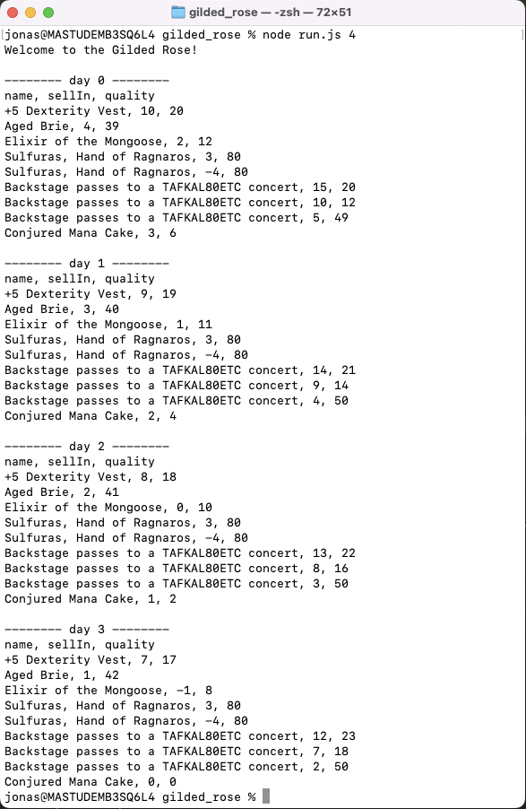

# The Gilded Rose Refactoring Exercise

This is a code kata originally devised by Terry Hughes. [Here](http://iamnotmyself.com/2011/02/14/refactor-this-the-gilded-rose-kata/) is a link to the original challenge.
It involves reading and understanding some poorly written code and refactoring it into high quality code.

High quality code to me means:
- easy to read
- easy to change
- reliable

The Gilded Rose is a shop with a item inventory system that updates the quality of each item and the number of days in which it has to be sold (sellIn) daily.

Here is a  of the program in action.

## Usage:
Download a copy of this repository, then, in the directory, run 

`npm install`

To run the tests, run

`jest`

To see the coverage, run 

`jest --coverage`

Type `node run.js <number of days>` to see the items in the shop and how their quality changes every day.

## My Approach:
There is a shop class that can be passed a list of items. It then classes the items into the correct child classes, depending on their name.  
Every day, the updateQuality function in the shop is called, which in turn calls the updateValues function for each item.

I used class inheritance and polymorphism to write different classes for different items. \

For each child class of Item and StockItem I reused some functions or parts of them and overrode others.   
By using inheritance it is easy to define a new class of items - just write a new class that inherits from StockItem and change the values or constraints that need to be different.

I wrote the programm following Test Driven Development (TDD), always starting with a test and then writing code to implement that feature. Each test increased the complexity of the program incrementally.

## These are my Item Classes:

- Item - all items in the shop are initially of the Item class.  
Unfortunately, the goblin in the corner wrote this and I am not allowed to change it because he doesn't believe in shared code ownership.
- StockItem - the standard item - a child class that inherits the constructor from Item and therefore gets all the arguments passed in automatically.   
It then defines the standard rate at which the item quality degrades and how sellIn gets reduced each day.   
It has a method to update the values.

The following are children of StockItem:
- BetterWithAge - handles items that increase in value (for example 'Aged Brie')
- Sulfuras - a magical weapon whose values don't change.
- ConjuredItem - they degrade at twice the speed of normal items

- BackstagePass - extends BetterWithAge - increases in value quicker the closer to the sellIn (the concert date) we get.

